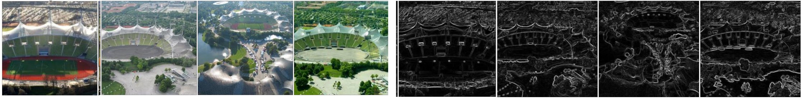

# Manifold learning of images of buildings to identify a trend in architecture

Interdisciplinary project at Technical University of Munihch (TUM CIT, MSc. Computer Science)

@Chair of Urban Development, TUM

## Abstract
- Pre-knowledge
    - Pritzker Prize: it is called Novel award in architecture. The prestigious Prizker Prize in architecture plays a guiding role in architecture.
    - Central role that visibility of building plays in architecture
        - Since the emergence of social media, architects try to design a architecture in a certain way such that it can be captured by many people as iconic building. 
            - This means that architects but also people are creating the trend of architecutral designs. Architects can not ignore the power of circulation of images of buildings.

We assume that there is a shift around 2009 in the architectural design. Professionals describes it with "Iconic fatigue". 

While the terminology "Iconicity" in architecture is described differently by professionals because of its complexity, one can describe that building became iconic because of the circulation of its images on social media since early 2000s. There were some trend in architecture such that city mayors invite famous architect to inaugurate such a iconic cultural institution because of the large economic impact. However, in the last few years, there seems to be an emergent iconic fatigue in architecture. This can be evident from contexts of the Prizker Prize jury citation, while it is described in literature with several different perspectives including backgroud of the year. If we take into consideration the architecuture of the recipients of the Prizker Prize, can we identify a shift troughout the years? What can images of buidlings designed by Prizker Prize laureates tell us about the development of award-worthy architecture as captured by the Prizker Prize.
My manifold learning pipeline allows us to analyze intrinsic features of architectural projects systematically; we can describe the similarities between architectural projects. Accordingly, we can infer whether there has been a shift in high-profile architecuture production based on images that are scraped from the Internet.

## Selected 21 architectural projects

- observation period: 1999-2019
- chose one project per each awardee (in total, 21 architectural projects)
- We chose twenty-one architectural projects, primarily cultural institutions such as auditoriums, conference centres, museums, and schools, designed by Pritzker Prize laureates between 1999 and 2019.

## System Overview
1. Loading dataset (images with additional information)
    - Image scraper
    - Image loader
2. Image pre-processing
    - Image transformer
    - Difference of Gaussians creater
3. Manifold learning
    - Autoencoder
4. Dimensionality reduction
    - LDA dimensionality reduction
5. Visualization of results
    - Visualizer of a latent structure mapping

## Enviroment
- Python 3.10.9
    - Packages: pip-install requirement.txt
- Manjaro Linux
- Anaconda 22.9.0
    - Python 3.10.9
    - Package list (check ./requirements.txt)
- Jupyter Notebook

## Dataset
- You can scrape images from Microsoft Bing by using tools for image scrapers (./utils)

## Resutls
### The latent structure mapping of selected 21 architectural projetcs
By extracting two directions that are the two most variant directions among 21 classes by using LDA dimensionality reduction, we could obtain the latent structure mapping. We had 15 DoG images for training and validation of our neural network and 10 DoG images for tests. Each class has 10 plots which represent 2-dimensional intrinsic feature representatives obtained by applying LDA dimensionality reduction after feeding 10 DoG images for each architectural project from the test image data set.

For the ease of performing semantic understanding, I have displayed a sample image of each individual architectural project as follows.

# First observation: Compact clusters and Non-compact clusters
Our first observation pertained to how the images of each architectural project are distributed in the latent structure mapping. By applying Principal Component Analysis (PCA) to each class, I can obtain the two most variant direction and their variance, which can describe the distribution of plots for each building. From this result, I can find which type each cluster belongs to, a compact cluster or a non-compact cluster. To determine those profiles of a cluster, I need to derive the maximum variance ratio (MVR). MVR can be derived as follows where maximum variance $\sigma_{i,max}^2$ and minimum variance $\sigma_{i,min}^2$ of ith building. 

$$\text{MVR}(i) = \frac{\sigma_{i,max}^2}{\sigma_{i,max}^2 + \sigma_{i,min}^2} (\leqq1.0)$$

As the MVR gets close to 0.5, a cluster becomes a compact cluster and it will be close to isotropic Gaussian distribution. On the other hand, as the MVR gets close to 1.0, a cluster becomes a non-compact cluster and it will be an anisotropic Gaussian distribution. By sorting the maximum variance ratio among 21 architectural projects as shown, I could derive the top 3 compact clusters and the top 3 non-compact clusters in the latent structure mapping. These clusters can be seen with segmentation.

Top 3 compact clusters

1. Centre Pompidou (Richard Rogers, 2007)
2. Tate Modern (Jacques Herzog and Pierre de Meuron, 2001)
3. Sydney Opera House (Jørn Utzon, 2003)

Top 3 noncompact clusters
1. Tagore Memorial Hall (Balkrishna Doshi, 2018)
2. Siamese Towers (Alejadro Aravena, 2016)
3. Guthrie Theatre (Atelier Jean Neouvel, 2008)

From this analysis of cluster type in the latent structure mapping, I could find that compact clusters have high visual feature consistency among images of the building. This visual feature consistency enables us to recognise the building instantly (e.g., Centre Pompidou). As I visualize sample RGB images and their corresponding Sobel-filtered images obtained for human perception, Centre Pompidou has high visual feature consistency in its staircase among its images. 

On the other hand, I could also say that the buildings with non-compact clusters could be not identified easily because of their low visual feature consistency. This intends that architectural projects with compact clusters in the latent structure mapping are taken its appearance by people from similar perspectives or the building itself has consistent visual features in different perspectives.

# Second observation: outliers
Additionally, I could also find that there are two big outliers as follows.

- Munich Olympic Park (Frei Otto, 2015)

- Centre Pompidou (Richard Rogers, 2007)

By looking at the images of these two buildings, I can identify that both have strong discriminative and distinctive visual features. I show only four sample RGB images and their Sobel-filtered images obtained for human perception for each project, Centre Pompidou and Munich Olympia Park, respectively.

# Third observation: high similarities to Sydney Opera House

Our third observation pertained to the high similarities to the Sydney Opera House. I are interested in the Sydney Opera House because it is a very iconic building. I would like to see if there is a trend to award architects whose buildings have similar visual features to the Sydney Opera House. I can identify two projects, Centre-Pompidou Mets and Qatar National Convention Centre. 

The following buildings are close to the Sydney Opera House in the latent structure mapping.
- Centre Pompidou-Metz (Shigeru Ban, 2014)
- Qatar National Convention Center (Arata Isozaki, 2019)

This finding allows us to find high similarities between the three architectural projects in terms of their architectural structure. They have a curvature within their facades. By referring to sample images of the individual project with Sobel-filtered images for edge detection and visualisation for human perception, I could see the curvature in their design for respective projects.

# Fourth observation: Chronological trajectory from 1999 to 2019
Finally, our fourth observation pertained to the result of the analysis of chronological trajectory on the latent structure mapping. For this analysis, I identify the centroid for each project cluster and then I connect these centroids in chronological order according to the year of award. I show centroids and edges between them from before 2009 with green colour and after 2009 with red colour. 

By tracing centroids in the order of year of the award, I could obtain the latent structure mapping with trajectory. 

I could see that before 2009 that were depicted with green colour were observed mainly in the under part, while after 2009 they are depicted with red colour in the upper part of feature space. To make more sense of this, I eliminated one outlier from each group. Munich Olympia Park was designed by Frei Otto from the Red Group and Sydney Opera House was designed by Jorn Utzon from the Green Group. Our rationale was that these two projects were awarded as lifetime achievement awards. They have a high potential to be classified as outliers among twenty-one architectural projects and I eliminated these two architectural projects as outliers from our considerations. By removing two outliers \#4 Sydney Opera House and \#16 Munich Olympia Park from each group, I can classify before 2009 and after 2009 with possible non-linear classifiers.

Subsequently, I looked at images of each architectural project closer to understand this mapping semantically referring to Sobel filtered sample image for each project for our semantic understanding of twenty-one architectural projects. 

I looked at some of the images of each architectural project closer to understand this mapping semantically. From the red group after 2009, I looked at the New Museum designed by SANA. This mapped farthest from the classifier (drawn with yellow colour) and classified in the red group. When I looked at the image of this building closer, this building has a large bold structure with few windows. If I looked at the other extreme, a project farthest away from the yellow line, \#8 Centre Pompidou designed by Shigeru Ban. This building has a more detailed structure with more windows. Then I looked at a project from the green group that is close to the classifier (yellow line). When I look at the image of this building closer, this building has a large bold structure with few windows. It is closer to the feature of the red group. The opposite is also true. A project which is mapped close to the yellow line from the red group, for instance, Siamese Towers designed by Alejandro Aravena. This building has a more detailed structure with more windows as I can recognise. This project has similar features to the characteristics of the green group.

